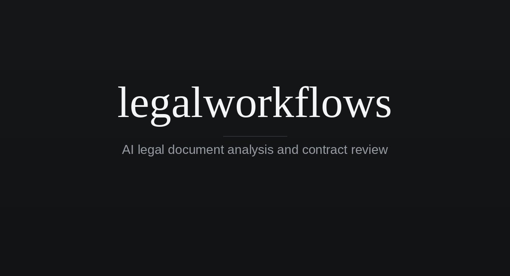

# legalworkflows



legalworkflows is a legal AI service for document review, drafting, and legal
research. The assistant is referred to as LWF in the product.

It combines a Next.js frontend, an Express backend, Supabase Auth/Postgres,
and Cloudflare R2-compatible object storage, and is consumed by the Juralio
matter management platform over HTTP.

Derived from [Mike](https://github.com/open-legal-products/mike) by Open Legal
Products, licensed under AGPL-3.0. This is a modified version, modified by
Fraser Matcham beginning 8 September 2026; see [NOTICE](NOTICE) for the
modification and licence notices required by AGPL-3.0 sections 5(a) and 5(b),
[LICENSE](LICENSE) for the licence itself, and
[docs/upstream-sync.md](docs/upstream-sync.md) for how upstream is tracked.

Before changing anything here, read the fork rules at the top of
[AGENTS.md](AGENTS.md).

## Features

- Chat with legal documents and open matters
- Review documents and apply suggested edits
- Run reusable assistant and tabular-review workflows
- Organize projects, folders, and a document library
- Verify citations and research US case law with CourtListener
- Work from Microsoft Word with the beta task-pane add-in
- Run supported language models locally through Ollama

## Quick start

The included Docker Compose stack runs legalworkflows, Supabase, RustFS object storage,
and local email capture without requiring managed infrastructure.

1. Copy the local environment templates:

   ```bash
   cp .env.example .env
   cp backend/.env.example backend/.env
   ```

2. In `backend/.env`, set `DOWNLOAD_SIGNING_SECRET` and
   `USER_API_KEYS_ENCRYPTION_SECRET` to separate values generated with:

   ```bash
   openssl rand -hex 32
   ```

3. Add an Anthropic, Gemini, or OpenAI API key to `backend/.env`, unless you
   plan to use Ollama exclusively.

4. Start the stack:

   ```bash
   docker compose up --build
   ```

5. Open [http://localhost:3000](http://localhost:3000) and create an account.

The bundled credentials and infrastructure are intended for local development
only. See [Local development](docs/local-development.md) for service endpoints,
authentication behavior, Ollama setup, and first-run guidance.

## Repository

| Path | Purpose |
| --- | --- |
| `frontend/` | Next.js web application |
| `backend/` | Express API, document processing, and database access |
| `word-addin/` | Microsoft Word task-pane add-in (beta) |
| `backend/schema.sql` | Complete schema for fresh databases |
| `backend/migrations/` | Dated migrations for existing deployments |
| `docker-compose.yml` | Local application and infrastructure stack |
| `docs/` | Development, deployment, testing, and feature guides |

## Documentation

- [Documentation index](docs/README.md)
- [Local development](docs/local-development.md)
- [Manual and production deployment](docs/deployment.md)
- [Troubleshooting](docs/troubleshooting.md)
- [CourtListener integration](docs/courtlistener.md)
- [Microsoft Word add-in](word-addin/README.md)
- [Tamper-evident exports](docs/tamper-evident-exports.md)
- [Safe local testing](docs/safe-local-testing.md)
- [End-to-end testing and CI](docs/e2e-ci.md)
- [Contributing](CONTRIBUTING.md)
- [Security policy](SECURITY.md)

## System workflows

The system assistant and tabular-review workflows are maintained in the
[`Open-Legal-Products/mike-workflows`](https://github.com/Open-Legal-Products/mike-workflows)
repository. See [Contributing](CONTRIBUTING.md#system-workflows) for how they are
packaged and synchronized with this application.

## License

Copyright (C) 2026 Fraser Matcham. Portions copyright Open Legal Products and
its contributors.

legalworkflows is available under the [GNU Affero General Public License v3.0](LICENSE).
It is distributed WITHOUT ANY WARRANTY; see [NOTICE](NOTICE) for the full
notices, which the running application also displays at `/legal`.

Section 13 of the licence applies: where users interact with a modified version
over a network, the operator of that instance must offer them the Corresponding
Source of the version they are interacting with, at no charge.
