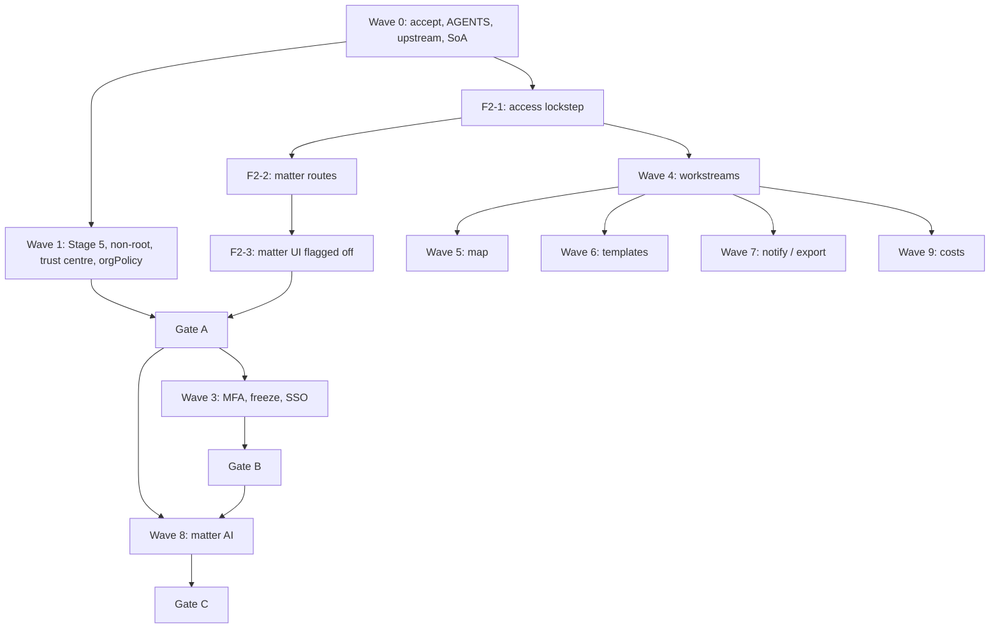

# Fold-in execution: priority waves and PR-sized tasks

How to ship [matter-fold-in.md](matter-fold-in.md). Companion to
[architecture](matter-fold-in-architecture.md) and
[compliance](matter-fold-in-compliance.md). Decisions D1–D17 are
assumed.

This is an execution breakdown, not a new design. If a task here
disagrees with the plan, the plan wins.

IDs start at **2200** so they can share a Jira project with the
extraction backlog (2001–2126) without collision. Each **task** is one
pull request (or one operator action, marked **Ops**). Stories group
PRs; epics are waves.

---

## How to work a task

- One branch per task: `feature/<id>-<short-slug>`.
- New files wherever you can (fork rule 3). Inherited edits are named
  in the task; do not widen them.
- Schema + something that reads it (tests or routes) in the same PR.
  No schema-only merges.
- Do not enable `MATTERS_ENABLED` on production until Gate A.
- Do not apply a matters migration during the Stage 5 freeze/copy
  window. Develop against current `schema.sql` in CI; it rides the dump.
- Paste the task's **Does** / **Files** / **Done when** into the agent
  session as the brief, **under** the copy-paste block in
  [matter-fold-in-lanes.md](matter-fold-in-lanes.md). Assign **one
  lane**. If the path is not on that lane's may-edit / may-create
  list, the agent must stop.

Definition of done: merged, CI green (`tenancy`, `boundary`,
`api-contract`, `schema-privileges`, `trademarks` as applicable),
acceptance met, docs updated where behaviour changed.

---

## Priority waves

The phase numbers in the plan stay. Waves are the **priority order
and parallelism**. Lower waves may be *developed* on branches once
their schema dependency exists; they do not *merge to production with
the flag on* until the gate.

| Wave | Priority | Plan phases | Unlocks | Parallel with |
| --- | --- | --- | --- | --- |
| **0** | P0 | 0 | Plan accepted; no second production; inherited files current | — |
| **1** | P0 | 1 | Gate A prerequisite (backups, evidence, flags) | Wave 0 after F0-2; Stage 5 tickets 2110–2126 |
| **2** | P0 | 2 | Gate A (operator, non-client / synthetic only) | Wave 1 code; **not** the freeze/copy window |
| **3** | P1 | 3 | Gate B (paying firm) | After Gate A; SSO (F3-4) can wait on D6 |
| **4** | P2 | 4 | The spine (workstreams / tasks / posts) | After F2-1 is on `main` |
| **5** | P3 | 5 | Taskmap / roadmap / labels | After F4-2 |
| **6** | P3 | 6 | Workstream templates | After F4-2 |
| **7** | P3 | 7 | Notifications, history, export | After F4-2 |
| **8** | P4 | 8 | Gate C (matter-aware AI) | After Gate A (operator) or Gate B (firm); DPIA accepted |
| **9** | P5 | 9 | Costs (D7: after AI) | After F4-2; `costs_enabled` still default off |

**Do not start** Wave 8 for customers or Wave 9 in the same slice as
Wave 2. **Do not** apply LMM `environments/prod`. **Do not** build a
migrator (D8).

**Lanes, contended files, and legal concurrent sets:**
[matter-fold-in-lanes.md](matter-fold-in-lanes.md). That file is the
source of truth for who may edit which path. Do not start a second
agent on a path that file marks as owned.

---

## Wave 0 — Stop the wrong work (P0)

**Epic 2200.** Outcome: one product, one ISMS scope, inherited files
current. No matter tables yet.

| ID | Lane | Type | Task | Depends | Points |
| --- | --- | --- | --- | --- | --- |
| F0-1 | prefix | PR | Record the fold-in as architecture decision 7 | Plan accepted | 1 |
| F0-2 | prefix | PR | Reword `AGENTS.md` rule 1 and delivery-plan README (D14) | F0-1 | 2 |
| F0-3 | prefix | PR | Upstream sync before any inherited fold-in edit | F0-2 | 5 |
| F0-4 | B | Docs | SoA draft + Art. 30 records + processing roles | F0-1 | 3 |
| F0-O1 | OPS | Ops | Do not apply LMM prod; keep `lmm-dev` spec-only | F0-1 | — |

### F0-1 — Architecture decision 7 (PR)

**Does:** add a row to `docs/delivery-plan/v2/architecture.md`: the
Juralio HTTP seam (2066–2069) is superseded by in-process fold-in; the
ISMS production scope is this origin only. Mark 2066–2069
*superseded* in `v2/status.csv`. Epic 2065 remains the licence-boundary
record; 2070 (boundary CI) already shipped and stays Done. Cite Matter
Management as prior art in `NOTICE` if not already.

**Files:** `docs/delivery-plan/v2/architecture.md`,
`docs/delivery-plan/v2/status.csv`, `NOTICE`.

**Done when:** a reviewer can see the seam is cancelled without reading
the fold-in plan. `npm run boundary` still green.

### F0-2 — Fork-rule wording (PR)

**Does:** reword `AGENTS.md` fork rule 1 from "Juralio calls this over
HTTP" to "no source combination with Apache-2.0 Juralio code —
reimplement, do not import". Same sentence in
`docs/delivery-plan/README.md` "Scope decisions". Licence reasoning
unchanged.

**Files:** `AGENTS.md`, `docs/delivery-plan/README.md`.

**Done when:** rule 1 no longer describes a topology the fold-in
makes false. Trademarks and boundary scripts unchanged.

### F0-3 — Upstream sync (PR)

**Does:** run `docs/upstream-sync.md` so `access.ts`, `app.ts`,
`AppSidebar.tsx`, `schema.sql` `projects`, and later
`toolDispatcher.ts` are not merged twice. Check
`git diff main..upstream-main -- backend/schema.sql` for a colliding
`matter_id`.

**Files:** whatever the sync touches. Not a fold-in feature PR.

**Done when:** `main` has absorbed current `upstream-main`. Record the
sync date in the PR.

### F0-4 — SoA and Art. 30 (docs PR)

**Does:** draft the Statement of Applicability from
[matter-fold-in-compliance.md](matter-fold-in-compliance.md) (include /
exclude / inherit-from-AWS, one-line each). Draft Art. 30 records for
processor (matter data) and controller (account data), region
`eu-west-2`. Record D12 on the SoA (operator owns DPIA, no external
counsel). Sub-processor list from AWS services and model providers
actually used.

**Files:** new under `docs/` (suggested `docs/isms/soa-draft.md`,
`docs/isms/ropa-draft.md`). Not product copy; not a certificate.

**Done when:** every Annex A control in the compliance annex has a
row. "We have not built it yet" is Phase 1/3 work, not an exclusion.

### F0-O1 — Operator: no second production

**Does:** do not apply
`legal-matter-management-infrastructure/environments/prod`. `lmm-dev`
stays as a living spec. No migrator (D8).

---

## Wave 1 — Control plane (P0, Gate A prerequisite)

**Epic 2210.** Outcome: 2095 closed on Stage 5 RDS (D5, D17), non-root
image, trust centre, `orgPolicy` flags, authenticated smoke, log
contract, incident runbook, DPIA *opened*.

Stage 5 engineering tickets **already exist** (2110–2126). This wave
does not duplicate them. It names the fold-in deltas and the work
that is not in Stage 5.

| ID | Lane | Type | Task | Depends | Points |
| --- | --- | --- | --- | --- | --- |
| F1-O1 | OPS | Ops | Stage 5 Task 1: RDS size, AZ, **35-day** backups (D17) | F0-1 | — |
| F1-O2 | OPS | Ops | Stage 5 Task 2: dump credentials | F1-O1 | — |
| F1-1 | A + OPS | Existing | Rehearse + cut over (2124–2125); close 2095 | F1-O1, F1-O2 | — |
| F1-2 | A | PR | Non-root backend image; DOCX conversion still works | F0-3 | 5 |
| F1-3 | B | PR | `orgPolicy.ts` flags (MFA, BYOK/MCP, residency, freeze stub) | F0-3 | 3 |
| F1-4 | B | PR | Trust-centre facts pages next to `/legal` | F1-3 | 3 |
| F1-5 | A | PR | Authenticated live smoke including a tenancy denial | F1-1 preferred | 3 |
| F1-6 | A | PR | Log-redaction contract tests + unified incident runbook | F0-3 | 2 |
| F1-O3 | OPS | Ops | Open the DPIA (D12); RPO/RTO in Art. 28 facts | F1-4 | — |

### F1-1 — Close 2095 on Stage 5

Not a new ticket. Walk `docs/runbooks/platform-cutover.md` and
`docs/runbooks/restore.md`. Restore criterion is the one 2095 already
writes. After migrate, PostgREST schema cache reloads via dbtools.
Override Stage 5 Task 1's "seven days" with **35 days** (D17). Delete
the Supabase project only after cutover (Stage 5 Task 6).

**Done when:** the application runs against data restored from RDS
automated backups. Ticket 2095 closed.

### F1-2 — Non-root backend image (PR)

**Does:** `backend/Dockerfile` runs as non-root with a writable
LibreOffice profile. Conversion-tested, not guessed
(`docs/security-review.md`). ECS Exec stays off (already default).

**Files:** `backend/Dockerfile`, image-scan still empty allowlist.

**Done when:** a DOCX converts to PDF in the image; container user is
not root.

### F1-3 — Org policy module (PR)

**Does:** new `backend/src/lib/orgPolicy.ts` plus org columns /
flags: `mfa_enforced` (stored now, enforced Wave 3),
`allow_unvetted_model_destinations` default false, provider-residency
default UK/EU + zero retention (D10), freeze/read-only stub.
Platform `MATTERS_ENABLED` env (same pattern as
`NEXT_PUBLIC_WORKFLOW_CONTRIBUTIONS_ENABLED`) plus
`MATTERS_OPERATOR_ORG_ID` for synthetic use. No hard-coded UUID.
Matter-linked BYOK/MCP **fail closed** if the column is missing.

**Files:** `backend/src/lib/orgPolicy.ts`, migration + `schema.sql`
for org flags, `frontend/src/app/lib/env.ts` for the public flag if
the sidebar needs it later.

**Done when:** unit tests cover fail-closed; unlinked work still
fail-open-and-loud on the MFA-column fault.

### F1-4 — Trust centre (PR)

**Does:** pages under `frontend/src/app/legal/` (or adjacent):
location `eu-west-2`, encryption, sub-processors (AWS, SES, each LLM
with region and what is sent), export, delete, backup window and
tail, incident notify-the-firm (72 hours is the firm's), no-training
statement for this service, password floor (min 10, TOTP, rotation)
even before cutover.

**Files:** new pages; link from existing `/legal`. No "certified" copy.

**Done when:** every fact an Art. 28 pack recites is on a page.

### F1-5 — Authenticated smoke (PR)

**Does:** extend `npm run smoke` (today anonymous) with a signed-in
tenancy-denial case against production. Outstanding half of the
security review.

**Files:** smoke scripts as they exist today.

**Done when:** a second user requesting the first user's resource is
denied on live.

### F1-6 — Logs and incident path (PR)

**Does:** tests that fail if a matter name, client name, prompt, or
post body is logged (contract can land before those columns exist).
One incident runbook for the unified origin. Do not enable ECS Exec
to debug client files.

**Files:** `backend/src/middleware/requestLog.ts` tests,
`docs/runbooks/` incident page if missing.

**Done when:** a deliberately logged matter name turns a test red.

---

## Wave 2 — Matter container (P0, Gate A)

**Epic 2230.** Outcome: a lawyer (operator, D1) can open a matter and
use existing documents/AI *in that matter*. Classification, retention,
legal hold, and destroy are in the first schema.

**Split rule:** F2-1 is the confidentiality PR and cannot be sliced.
UI is a separate PR so the hook is reviewable. Routes sit in the
middle and may merge with F2-1 if the diff stays reviewable; they
must not merge without F2-1's tests.

| ID | Lane | Type | Task | Depends | Points |
| --- | --- | --- | --- | --- | --- |
| F2-1 | C | PR | Schema + `matterAccess` + SQL/list lockstep + tests | F0-3, F1-3 | 8 |
| F2-2 | C | PR | Matter HTTP routes, destroy, legal hold, audit | F2-1 | 5 |
| F2-3 | D | PR | Matter UI, sidebar behind env flag | F2-2 | 5 |
| F2-4 | C | PR | `data-retention.md` + cleanup inventories | F2-1 | 2 |
| F2-O1 | OPS | Ops | Gate A checklist; then `MATTERS_ENABLED=true` | F1-1, F2-3, F2-4 | — |

### F2-1 — Access lockstep (PR) — do not split

**Does:**

- Migration + `schema.sql`: `matters`, `matter_members`,
  `projects.matter_id` (nullable, unique default workspace, org-scoped
  only), `audit_events.matter_id` + index, org flags already in F1-3,
  `revoke` + `service_role_all` on every new RLS table.
- `backend/src/lib/matters/matterAccess.ts`
  `(userId, matterId, currentOrgId)` — org id from URL/resource, not a
  cookie.
- One inherited call: `checkProjectAccess` (and chat / tabular /
  document helpers) **return `matterAccess` when `matter_id` is set**.
- **Same PR:** `project_access_role`, `chat_access_role`,
  `review_access_role`, `get_projects_overview`,
  `get_project_summaries`, `get_chats_overview`,
  `listAccessibleProjectIds`, `listOrgResources`.
- `ORG_CONTENT_TABLES` / account-deletion probes include `matters` /
  `matter_members`.
- Stryker on `access.ts` is in this PR's budget.

**Files:** `backend/migrations/YYYYMMDD_NN_matters.sql`,
`backend/schema.sql`, `backend/src/lib/matters/matterAccess.ts`,
`backend/src/lib/access.ts`, `backend/src/lib/orgs.ts`,
`backend/src/lib/userDataCleanup.ts`,
`backend/src/__tests__/**/matters.crossMatter.test.ts` plus existing
project-access and overview suites.

**Done when:** an org member not on the matter cannot **open or list**
the linked project, its chats, or its tabular reviews. Email grants on
a matter-linked project 403. Personal projects stay unlinked. Destroy
tests can wait for F2-2.

### F2-2 — Matter routes (PR)

**Does:** `backend/src/routes/matters.ts` mounted in `app.ts`. CRUD,
members, placeholders (no auth), create default org-scoped project,
destroy refuses `legal_hold` (409) and otherwise removes rows **and**
objects; inserts a destruction audit row, never `DELETE FROM
audit_events`. Legal hold (D15) freezes document/version/post
deletion too. Create: org admin or `matter_creator` only; 403 when
`MATTERS_ENABLED` is false unless operator org id matches. JSON cap
2mb on this router. `docs/api-contract.md` updated. `npm run tenancy`
sees the handlers.

**Files:** `backend/src/routes/matters.ts`, `backend/src/app.ts`,
`docs/api-contract.md`, route integration tests.

**Done when:** tenancy, role matrix, legal-hold destroy refusal, and
tight JSON cap tests pass.

### F2-3 — Matter UI (PR)

**Does:** `/organizations/[orgId]/matters` and `[matterId]` under
`frontend/src/app/(pages)/organizations/[id]/matters/`. Overview,
People, Documents, Assistant, Tabular, Workstreams stub. Sidebar item
only when `MATTERS_ENABLED`. `matterApi.ts` new; `mikeApi.ts` calls
it once if needed. Reuse `PageHeader`, `TablePrimitive`, people
modals. No client name or matter description in the document title
sent to a model without the existing redaction path.

**Files:** pages, `frontend/src/app/components/matters/`,
`frontend/src/app/lib/matterApi.ts`,
`frontend/src/app/components/shared/AppSidebar.tsx` (one nav item).

**Done when:** create matter → default project → upload → chat →
tabular, without leaving the matter. Unlinked `/projects` unchanged
(D4). Flag off: sidebar absent, create 403.

### F2-4 — Retention docs (PR)

**Does:** update `docs/data-retention.md`: what a matter is, what
delete does, what legal hold does, backup tail, audit-row survival.
Classification default Confidential, LPP-capable.

**Done when:** the doc matches the schema in F2-1.

### F2-O1 — Gate A

Walk [the Gate A checklist](matter-fold-in-compliance.md#gate-a).
Then set `MATTERS_ENABLED=true` as a recorded change. Content limited
to operator-owned non-client material and synthetic matters (D1).

---

## Wave 3 — Firm identity (P1, Gate B)

**Epic 2250.** Paying firms do not store files without this.

| ID | Lane | Type | Task | Depends | Points |
| --- | --- | --- | --- | --- | --- |
| F3-1 | F | PR | Enforce `mfa_enforced` on matter-holding orgs; fail closed | F2-2, F1-3 | 5 |
| F3-2 | F | PR | Member removal + GoTrue session revoke, one transaction | F2-2 | 3 |
| F3-3 | F | PR | Org freeze / read-only | F2-2, F1-3 | 3 |
| F3-4 | F | PR | Microsoft SSO on GoTrue (D6: when a firm needs it) | F1-1 | 5 |
| F3-O1 | OPS | Ops | Gate B: Art. 28 signed, CE submitted, org provider policy | F3-1, F1-1 | — |

### F3-1 — MFA enforced (PR)

**Does:** matter-holding orgs require MFA. Matter-linked routes fail
closed if the MFA column is missing. Unlinked work keeps the existing
fail-open-and-loud fault. Metric for the operator either way.

**Files:** `backend/src/middleware/auth.ts` (small), `orgPolicy.ts`.

**Done when:** a matter-holding org member without MFA cannot open a
matter route.

### F3-2 — Session revoke (PR)

**Does:** removing a `matter_members` row and GoTrue admin session
revoke in one transaction, audited. No grant-table cache to unwind.

**Done when:** the removed user cannot reuse an existing cookie.

### F3-3 — Freeze (PR)

**Does:** org flag makes every matter handler read-only (ISO 5.18).
Not a fake Grails role.

### F3-4 — Microsoft SSO (PR)

**Does:** `GOTRUE_EXTERNAL_AZURE_*` + redirect
`https://legalworkflows.co.uk/auth/v1/callback`. Not a hard Gate B
blocker (D6): skip until a named firm needs it, if they accept
email+MFA in writing.

**Files:** `infra/modules/gotrue`, login UI, org flag.

### F3-O1 — Gate B

Walk [the Gate B checklist](matter-fold-in-compliance.md#gate-b--paying-firm).
SSO or written MFA-email acceptance. Stage 5 live, Supabase project
deleted.

---

## Wave 4 — Spine (P2)

**Epic 2270.** After F2-1 is on `main`. Flag may still be off.

| ID | Lane | Type | Task | Depends | Points |
| --- | --- | --- | --- | --- | --- |
| F4-1 | E | PR | Workstream / task / post schema, CHECKs, `lock_version`, limits | F2-1 | 5 |
| F4-2 | E | PR | Hierarchy lib + paged routes + 409 + date 4xx | F4-1 | 8 |
| F4-3 | E | PR | Task list UI (the accessible product) | F4-2, F2-3 | 5 |
| F4-4 | E | PR | Posts + sanitised rich text | F4-2, F4-3 | 5 |

### F4-1 — Schema (PR)

**Does:** `matter_workstreams`, private members, `matter_tasks`
(dates as dates in matter TZ D16, `lock_version`, limits 16/8/6/300),
blockers/assignees/followers, `matter_posts`. CHECK/trigger: a task's
workstream belongs to the same `matter_id`. `service_role_all` +
revokes.

**Done when:** drift check passes; a SQL attempt to reparent across
matters fails.

### F4-2 — Mutations (PR)

**Does:** `lib/matters/workstreams.ts`, `tasks.ts`, `posts.ts`; thin
routes; copy/move same-matter only (service + CHECK + named test);
`lock_version` mismatch → 409; date-consistency 4xx via
`userFacingError.ts` (LMM `API_ERROR_CODE` is the spec); list/tree
**paged**; JSON cap tight; `db_jobs` kinds reserved if fan-out starts
here.

**Done when:** `*.crossMatter.test.ts` covers copy/move; a stale indent
is 409.

### F4-3 — List UI (PR)

**Does:** workstream overview + task list + detail with
`TablePrimitive`. This list remains reachable in Wave 5. No
`JuralioTable`.

### F4-4 — Posts (PR)

**Does:** notes, meeting posts, typed links. TipTap only if no
primitive fits, in the feature folder, sanitised on render. Posts are
LPP-capable: not in logs.

---

## Wave 5 — Taskmap, roadmap, labels (P3)

**Epic 2290.**

| ID | Lane | Type | Task | Depends | Points |
| --- | --- | --- | --- | --- | --- |
| F5-1 | G5 | PR | `matter_labels` + task join; RAG as data, not a decorative pill | F4-2 | 3 |
| F5-2 | G5 | PR | Taskmap (D3 in feature folder); list remains the a11y surface | F4-3, F5-1 | 5 |
| F5-3 | G5 | PR | Roadmap | F4-3, F5-1 | 3 |

A workstream **cannot** be map-only. Tree fetch uses F4-2's paged
API; layout is client-side.

---

## Wave 6 — Templates (P3)

**Epic 2300.** Distinct from `mike_workflows`.

| ID | Lane | Type | Task | Depends | Points |
| --- | --- | --- | --- | --- | --- |
| F6-1 | G6 | PR | System + org template schema and copy-into-matter | F4-2 | 5 |
| F6-2 | G6 | PR | Template UI; org-admin export/import audited | F6-1 | 3 |

System templates contain no live client data.

---

## Wave 7 — Notifications, history, export (P3)

**Epic 2310.**

| ID | Lane | Type | Task | Depends | Points |
| --- | --- | --- | --- | --- | --- |
| F7-1 | G7 | PR | In-app inbox + `db_jobs` notify; SES body is "you have a notification" | F4-2 | 5 |
| F7-2 | G7 | PR | Matter-scoped history feed beside `audit_events` | F4-2 | 3 |
| F7-3 | G7 | PR | Matter-scoped export as `db_jobs` (D11; Law Society exit) | F4-2 | 5 |

Per-person search inside a matter is **not** in this wave (D11
residual).

---

## Wave 8 — Matter-aware AI (P4, Gate C)

**Epic 2320.** Blocked on an accepted DPIA for anyone but the operator.

| ID | Lane | Type | Task | Depends | Points |
| --- | --- | --- | --- | --- | --- |
| F8-1 | G8 | PR | Tools in a new module, called **once** from `toolDispatcher.ts` | F4-2, F2-1 | 5 |
| F8-2 | G8 | PR | Pre-send notice; audit provider+model never the prompt | F1-3, F8-1 | 3 |
| F8-O1 | OPS | Ops | DPIA accepted; Gate C checklist | F8-1, F8-2 | — |

### F8-1 — Tools (PR)

**Does:** `list_matter_tasks`, `read_task`, `add_task_post` with the
same `matterAccess` as HTTP; another matter's id is 404. Posts are
untrusted input to the model. Do not edit tools into the middle of
`toolDispatcher.ts`.

**Done when:** `*.crossMatter.test.ts` covers tools.

---

## Wave 9 — Costs (P5)

**Epic 2330.** After Wave 8 (D7). `costs_enabled` default false.

| ID | Lane | Type | Task | Depends | Points |
| --- | --- | --- | --- | --- | --- |
| F9-1 | G9 | PR | Pure costs functions + numeric fixtures (no xlsx from LMM) | F4-1 | 8 |
| F9-2 | G9 | PR | Costs schema + routes; `costs` membership 403 | F9-1, F2-2 | 5 |
| F9-3 | G9 | PR | Client vs advisor views + audited Excel export | F9-2 | 5 |

F9-1 **before** any UI. Gaps block snapshot save. Client vs advisor
are two audiences, not two CSS views.

---

## Operator register (not PRs)

| ID | Lane | When | Action |
| --- | --- | --- | --- |
| F0-O1 | OPS | Wave 0 | Do not apply LMM prod |
| F1-O1 | OPS | Wave 1 start | Stage 5 Task 1: size, AZ, **35-day** backups |
| F1-O2 | OPS | Wave 1 start | Stage 5 Task 2: dump credentials |
| F1-O3 | OPS | Wave 1 | Open DPIA; put RPO/RTO on the facts pack |
| F2-O1 | OPS | After F1-1 + F2-3 | Gate A, then `MATTERS_ENABLED` |
| F3-O1 | OPS | After F3-1 | Gate B / Art. 28 / CE |
| F8-O1 | OPS | After F8-1 | DPIA accepted, Gate C |

Certification (CE → Plus → 27001 → 27701, D9) is an operator
programme on top of Gates A–B. It is not a software wave.

---

## What not to ticket

| Out | Why |
| --- | --- |
| HTTP seam 2066–2069 | Superseded (F0-1). 2070 (boundary CI) stays Done. |
| LMM production Terraform | Second ISMS |
| Migrator | D8 |
| Instance sysadmin, seats, Drive | After a second customer |
| Redis, third Express, Grails sidecar | Architecture |
| Map-only workstream | A11y; F5-2 |
| Per-person SAR search | D11 residual |
| PITR | Later than D17 |
| Claiming "certified" in UI | No body has said so |

---

## First five merges (start here)

1. **F0-1** (prefix) — decision 7 + supersede 2066–2069 (2070 stays).
2. **F0-2** (prefix) — `AGENTS.md` rule 1.
3. **F0-3** (prefix) — upstream sync (blocks inherited edits).
4. **F1-O1 / F1-O2** (OPS) — Stage 5 Tasks 1–2 (blocks 2095).
5. **F1-3** (lane B) then **F2-1** (lane C) — flags, then the access
   lockstep. In parallel: F1-2 and F1-6 (lane A), F1-4 and F0-4 (lane
   B, after F1-3 has released `schema.sql`).

Do not launch lane C until F1-3 is on `main`. Do not launch lane E
while C still holds `schema.sql` (F2-1) or `app.ts` (F2-2, except
E's F4-1 which is schema-only after F2-1). Assign from
[matter-fold-in-lanes.md](matter-fold-in-lanes.md).

Wave 4+ feature branches may open once F2-1 is on `main`. They do not
turn the flag on.
