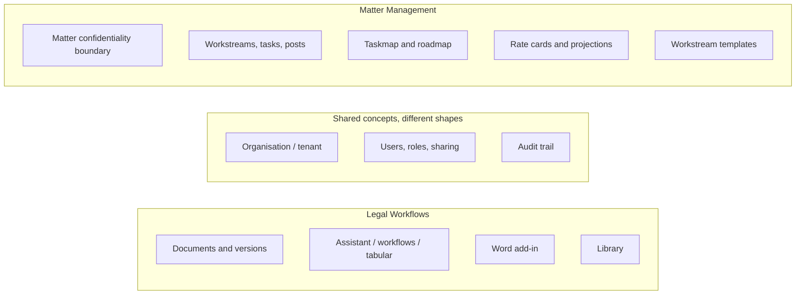

# Folding Matter Management into Legal Workflows

An engineering plan for making legalworkflows the single legal case-management
and workflow product, by taking the *features* of Legal Matter Management
(Juralio) and rebuilding them inside this codebase.

This is a product and architecture decision, not a merge of repositories.
It supersedes the deferred Juralio HTTP seam (backlog 2066–2069) as the
intended relationship between the two products. Ticket **2070**
(boundary CI: `npm run boundary`) already shipped and stays.

Compiled 19 September 2026 (certification-first revision the same day;
pre-execution factors embedded the same day),
against:

- this repository (`Fraser-Matcham/legalworkflows`) on `main`
- `Fraser-Matcham/legal-matter-management` (React SPA)
- `Fraser-Matcham/legal-matter-management-backend` (Grails API)
- `Fraser-Matcham/legal-matter-management-infrastructure` (Terraform)

---

## Recommendation

**Reimplement matter management as additive TypeScript modules in this
repository. Do not copy the Grails/MUI/Redux stack. Do not keep two UIs
talking over HTTP. Do not apply the Matter Management production Terraform.**

Treat the Matter Management tree as a **specification**: the data model in
`legal-matter-management-backend/docs/DATA-MODEL.md`, the confidentiality
rules, the costs engine, the taskmap/roadmap UX, and the org/matter admin
workflows. Rebuild those capabilities in the Next.js / Express / Postgres
shape this service already has, in new files, behind the existing design
system, auth, tenancy, and deploy pipeline.

That is the only way to get one product *and* keep the organised codebase
this fork was chosen for.

A unified service in the legal sector is a **processor of client matter
files**, including material that can attract legal professional privilege.
The plan is therefore **certification-first**: ISO 27001, ISO 27701, UK
GDPR, SRA confidentiality, Cyber Essentials Plus, and the Law Society
cloud practice note shape the architecture, the defaults, and the phase
order. Feature work does not start against production matter data until
the control plane that those standards require is in the product and
operable. The control baseline, Statement of Applicability mapping, and
launch checklists sit in
[matter-fold-in-compliance.md](matter-fold-in-compliance.md). The
hosting decision — topology, process model, codebase layout, and the
core-repo improvements required before this service can carry matters —
sits in
[matter-fold-in-architecture.md](matter-fold-in-architecture.md).
Execution is broken into priority waves and one-PR tasks in
[matter-fold-in-tasks.md](matter-fold-in-tasks.md). Parallel agents
must follow the lane exclusions in
[matter-fold-in-lanes.md](matter-fold-in-lanes.md).

---

## Why this direction

Three facts, all measured rather than hoped:

1. **Legal Workflows is already the production product.** It is live at
   `https://legalworkflows.co.uk`, AGPL-compliant, debranded, on AWS, with
   a documented design system, tenancy CI, an API contract, and runbooks.
   Architecture decision 2 already says this frontend is the product.
   Matter Management production has **never been applied**
   (`legal-matter-management-infrastructure/docs/PLAN-PRODUCTION.md`).
   Folding into the live, cleaner platform is cheaper than finishing a
   second production stack and then integrating it.

2. **The two products do different jobs and barely overlap.** Legal
   Workflows is document AI: chat, suggested edits, reusable workflows,
   tabular extraction, a document library, CourtListener, a Word add-in.
   Matter Management is work management: Matter → Workstream → Task → Post,
   with membership, labels, templates, and an optional costs/pricing
   engine. Neither currently calls the other. The planned HTTP seam was
   a later track, not a live integration.

3. **A mechanical merge would destroy the thing you like.** Matter
   Management is a Grails 7 / Groovy / GORM API (79 domain classes, 118
   controllers, 404 declared Liquibase changesets of which 402 run) plus a Vite/MUI/Redux
   HashRouter SPA. Legal Workflows is Next.js App Router, Express,
   TypeScript, shadcn/liquid-glass, colocated Vitest, and additive-change
   rules against an active upstream. Lifting Juralio into this tree as
   source would import a second framework, a second auth system, a second
   UI kit, and a second schema — and would violate fork rule 3 on every
   inherited file it touched.

---

## What each product is today

### Legal Workflows (this repository)

A legal AI service for document review, drafting, and research. The
assistant is LWF. Derived from `open-legal-products/mike`, AGPL-3.0.

| Layer | Stack |
| --- | --- |
| Frontend | Next.js App Router, liquid-glass / shadcn new-york |
| Backend | Express, TypeScript, service-role Supabase client |
| Auth | GoTrue (email/password, Google, TOTP MFA) |
| Data | Postgres (51 public tables in `schema.sql`), RLS enabled with no browser policies |
| Files | S3-compatible object storage, direct upload, LibreOffice conversion |
| Clients | Web app + Microsoft Word task-pane add-in |
| Deploy | Terraform on AWS; CloudFront single origin; ECS Fargate |

**User-visible surface:** Assistant, Projects, Library, Tabular Review,
Workflows, Organizations, Settings. Projects already carry a `cm_number`
(client/matter number) but are document workspaces, not matters.

**Not present:** matters, workstreams, hierarchical tasks, posts, costs,
rate cards, placeholders, matter membership (admin/team/viewer),
taskmap/roadmap, workstream templates, instance sysadmin, SAML/Okta/Microsoft
SSO.

### Legal Matter Management (three repositories)

A matter / project-management platform. User-facing name **Matter
Management**; internal package `com.juralio`. Derivative of
`noslegal/juralio`, Apache-2.0. The Juralio name and logo are excluded
from that grant.

Spine: **Organisation → Matter → Project (workstream) → Task (levels 1–6) → Post**.

| Layer | Stack |
| --- | --- |
| Frontend | React 19, Vite 7, MUI 9, Redux 5, HashRouter, i18next |
| Backend | Grails 7 / Groovy, Java 17, Tomcat 10.1, GORM |
| Auth | Opaque bearer + HttpOnly cookie, MFA, Microsoft/Google/Okta/SAML |
| Data | Postgres 16, Liquibase (91 tables after full apply) |
| Files | S3 for logos/uploads; documents are *links*, not a DMS |
| Deploy | Vercel SPA + ECS Fargate API; **dev live, prod never applied** |

**User-visible surface:** Home (matter cards, inbox), matter admin (people,
workstreams, archive, labels, history), workstream taskmap / roadmap /
task list, task posts, costs (optional), org admin, sysadmin.

**Not present:** LLM/assistant, document processing pipeline, tabular
review, Word add-in, workflow catalogue, CourtListener. "Workflow" in
this product is a **label type** on a task, not this service.

### Overlap and unique value



The fold-in is valuable because of the LMM column, not because of the
shared column. Organisations, users, and audit already exist here and
must be *extended*, not replaced.

---

## Alternatives considered

| Option | What it is | Why not |
| --- | --- | --- |
| **A. HTTP seam (2066–2069)** | Keep both products. Juralio proxies to this API, redeclares types, maps identity. | Leaves two codebases, two UIs, two auth systems. Identity mapping (2069) is unsolved. Does not produce "one solution". Was already deferred off the critical path. Boundary CI (2070) already exists in this repository and is kept. |
| **B. Reverse fold** | Put Legal Workflows features into Matter Management. | AGPL-3.0 section 5(c) would relicense the Apache-2.0 work as a whole. Fork rule 1 exists specifically to prevent this. Forbidden. |
| **C. Sidecar Grails** | Next.js UI talks to a still-running Grails API. | Two runtimes (Node + JVM), two databases, two session cookies, two deploy pipelines, forever. The "clean codebase" preference is lost on day one. |
| **D. Copy the SPA into `frontend/`** | Mount the MUI/Redux app next to App Router. | HashRouter vs App Router, MUI vs liquid-glass, Redux vs existing client state, i18n keys that still say Juralio internally. Users would see two products. |
| **E. Copy Groovy domain classes** | Translate GORM to SQL and keep behaviour byte-for-byte. | 404 changesets, Hibernate naming, `com.juralio` packages baked into table mapping. A translation is still a rewrite, with none of the benefit of designing for this schema. |
| **F. Reimplement here (chosen)** | New tables, routes, and UI in this repo. LMM is the spec. | Up-front cost. Costs-engine behaviour must be re-proven. Pays for itself in one codebase, one auth, one origin, one licence, one deploy. |

---

## Licence and fork rules

This plan is compatible with the four fork rules in `AGENTS.md`. It is
not compatible with a source merge.

### Combining the works

Apache-2.0 is compatible with AGPL-3.0 in **this direction only**: Apache
code may be incorporated into an AGPL work; the combination is AGPL.
The reverse is what fork rule 1 forbids.

If any Matter Management source is copied into this tree (a costs
algorithm, a date helper, a D3 layout), that file must:

- keep the Apache-2.0 notice and copyright
- mark it as changed, per Apache-2.0 section 4(c)
- add a Fraser Matcham copyright for the modifications
- be attributed in `NOTICE` / `THIRD-PARTY-NOTICES.md`
- **not** claim different terms in a header that contradicts `LICENSE`

Prefer **not** copying. Reimplementation from the published data model
and from observed behaviour (the frontend's costs CLAUDE.md is a
specification of calendar-day and rate-period rules that took a dozen
defects to pin down) avoids mixing licences in first-party files.

The Juralio name and logo stay out of user-visible copy, same as today.

### Additive change (fork rule 3)

Every new capability lands in **new files**:

| New | Touches an inherited file only to |
| --- | --- |
| `backend/src/routes/matters.ts` (and siblings) | mount the router in `app.ts` |
| `backend/src/lib/matters/matterAccess.ts` | be called from `access.ts` and the SQL list paths |
| `frontend/src/app/(pages)/organizations/[id]/matters/**` | add a nav item in `AppSidebar.tsx` |
| `backend/migrations/YYYYMMDD_NN_matters.sql` | plus the matching shape in `schema.sql` |

Do not rename `projects`, `mike_workflows`, `mikeApi.ts`, or the
`MIKE_WORKFLOWS_*` env vars. The UI may *label* a project as a matter's
document workspace; the table stays `projects`.

### Boundary CI

`scripts/check-repo-boundary.mjs` must keep failing on a cross-repo
import. This plan does not add one. Matter Management repositories
remain separate until they are archived; they are not git submodules,
workspaces, or `file:` dependencies.

Tickets 2066–2069 (Juralio-side proxy, redeclared types, identity
mapping) are **cancelled**, not implemented. Ticket **2070** (boundary
CI in this repository) already shipped and stays — it still forbids
combining this AGPL-3.0 tree with the Apache-2.0 Matter Management
source. The API contract remains: it is this product's own HTTP
surface, consumed by the Word add-in and by this frontend.

---

## Target product shape

One origin, one session, one sidebar.

**Legal Workflows** becomes a firm-facing platform whose spine is a
**matter**, and whose current AI/document features hang off that matter
rather than living in a parallel "projects" universe.

### Information architecture

```
Organisation
 └── Matter                          ← confidentiality boundary (new)
      ├── People (admin / team / viewer / costs / placeholders)
      ├── Workstreams                ← LMM "Project"
      │    └── Tasks (levels A–F)
      │         └── Posts (notes, meetings, external links)
      ├── Documents                  ← existing LWF `projects` + library
      ├── Assistant                  ← existing project/global chat
      ├── Tabular review             ← existing
      ├── Workflows                  ← existing catalogue, scoped to the matter
      └── Costs (optional)           ← LMM costs engine
```

Sidebar today: Assistant, Projects, Library, Tabular Review, Workflows.

Sidebar after the first shippable slice: **Assistant, Matters, Library,
Tabular Review, Workflows**. "Projects" becomes the document workspace
*inside* a matter (and remains available as a personal/org workspace
with no matter, so existing data and upstream behaviour keep working).

### Domain mapping — do not collapse these names

The word "project" means different things on each side. Collapsing them
is how the confidentiality boundary gets lost.

| Concept | Matter Management | Legal Workflows today | Unified product |
| --- | --- | --- | --- |
| Tenant | `Organisation` | `organizations` + `org_members` | **Keep LWF orgs.** Extend with flags LMM needs (`costs_enabled`, MFA-enforced, freeze). |
| Piece of legal work | `Matter` | `projects.cm_number` (label only) | **New `matters` table.** Confidentiality boundary. |
| Stream of work | `Project` (UI: workstream) | — | **New `matter_workstreams`.** Never named `projects` in SQL. |
| Document workspace | Link posts / Google Drive | `projects` + folders + `documents` | **Keep `projects`.** Optional `matter_id`. UI: "Documents" on the matter. |
| Unit of work | `Task` (6 levels, blockers) | — | **New `matter_tasks`.** |
| Note / link | `Post` | chat messages, document edits | **New `matter_posts`.** Not a substitute for documents. |
| Reusable structure | `ProjectTemplate` / `TaskTemplate` | `workflows`, library templates | **New workstream templates**, distinct from AI workflows. |
| Access | MatterAdmin / Team / Viewer / Costs; private workstream members | Owner / Editor / Viewer on projects and chats | **Matter membership is source of truth** for matter-linked content. **Least privilege:** only org admins create matters unless `matter_creator` is granted. Direct email grants on a matter-linked project are forbidden. |
| Costs | Rate cards, projections, snapshots | — | **New costs schema**, org-flagged. |
| AI | none | core product | Unchanged; now matter-aware. |

### How existing `projects` fit

`public.projects` stays. A nullable `matter_id` is added.

- `matter_id IS NULL` — today's personal or org document workspace. Upstream
  behaviour, sharing via `project_access_grants`, Word-add-in flows: unchanged.
- `matter_id IS NOT NULL` — the matter's document workspace. Access is
  **delegated to `matterAccess`**, not org-inherited and not cached in
  `project_access_grants`. Direct email grants on that row are
  forbidden. Creating a matter creates one default org-scoped project
  so Assistant, Tabular Review, and uploads have somewhere to live
  from day one.

Do not make a workstream a `projects` row. Workstreams are a task
hierarchy with date and costing semantics that documents do not have.
Do not make a matter a `projects` row either: a matter outlives any one
document set, has membership distinct from file sharing, and is the
boundary tasks are forbidden to cross.

### Confidentiality rule (load-bearing)

From the Matter Management frontend `CLAUDE.md` (the backend's copy
drops "that is"), kept verbatim as a product rule:

> Tasks move between workstreams but never between matters — that is a
> deliberate confidentiality boundary, not an oversight.

The same rule applies to posts, workstream-private members, and
matter-linked documents. A search, export, assistant tool, or tabular
review that can see across matters for a user who is only on one of them
is a defect, not a feature. `npm run tenancy` must cover every new
handler.

---

## Access model

Legal Workflows today: org `admin` / `member`, plus Owner / Editor / Viewer
on projects, workflows, and chats.

Matter Management: instance sysadmin; org owner/admin/matter-creator;
per-matter admin, team, viewer, costs; placeholders; private workstreams.

**For the fold-in, do not import the Grails role enum.** Extend what is
here. Defaults are **least privilege**: a capability is off until an org
admin turns it on.

| Layer | Roles | Notes |
| --- | --- | --- |
| Instance | none in product | No god-mode screen that can open a customer's matter. Operator break-glass is IAM-authenticated database access under a runbook, with the credential use in CloudTrail — not a shell into a task (ECS Exec stays off; session capture was rejected because it would record client files). Sysadmin/seat reports wait until a second customer exists *and* the ISMS has an access-rights procedure for them. |
| Organisation | existing `admin` / `member`; optional `matter_creator` | Only org admins create matters unless `matter_creator` is granted. `costs_enabled` is an org flag, default **false**. `mfa_enforced` is an org flag, default **true** once the org holds a matter; the flag is stored from Phase 2 and **enforced** from Phase 3, and the trust centre must say which until then. |
| Matter | `admin`, `team`, `viewer`, `costs` | Stored on `matter_members`. `admin` is a membership, not `ROLE_MATTER_ADMIN`. |
| Workstream | optional private-member list | If set, team members not on the list cannot see that workstream. |
| Linked `projects` row | **not** org-inherited | When `matter_id` is set, `checkProjectAccess` (and chat / tabular / document helpers that call it) **delegates to `matterAccess`**. Org-member inheritance would leak every org member into the matter's documents. Email grants already apply only to personal projects and stay forbidden here. Do not write a cache of `project_access_grants` or `project_org_access_overrides` unless a later measurement says we must; membership is the source of truth. |
| Placeholders | pre-account people | Assignable to tasks; **cannot authenticate**. Convert to a user on invite accept. New table, not `auth.users`. Conversion and member removal are audited. |

Handler-level enforcement stays in Express (`lib/access.ts` plus a new
`lib/matters/matterAccess.ts`). `matterAccess` takes **`(userId, matterId,
currentOrgId)`** — a user may belong to many orgs; firm A's admin
session must not see firm B's tasks. Personal projects
(`org_id IS NULL`) are never attached to a matter; creating a matter
creates a new org-scoped default workspace (decision D3). Promoting an
existing personal project into a matter is out of scope.

When `projects.matter_id` is set, `checkProjectAccess` **delegates to
`matterAccess`** and does not apply org-member inheritance or email
grants. The same predicate must land, in the same PR, in every list
path that currently copies org inheritance in SQL or TypeScript and
**never calls** `checkProjectAccess`:

- `project_access_role` in `backend/schema.sql` (and
  `chat_access_role` / `review_access_role`, which delegate to it)
- `get_projects_overview`, `get_project_summaries`, `get_chats_overview`
- `listAccessibleProjectIds` in `access.ts` (document search)
- `listOrgResources` in `orgs.ts` (org workspace; a name/`cm_number`
  in that list is the ethical-wall leak the comment already describes)

`access.ts` already warns that the TypeScript and SQL predicates must
stay in lockstep, or a row is openable by URL while invisible in the
list — or the reverse. Tests for the hook **and** those list RPCs land
before any Matter UI.

`currentOrgId` has no cookie or session field today. Org context is the
resource's `org_id` or the URL (`/organizations/[id]`). Matter routes
follow that: `/organizations/[orgId]/matters`. `matterAccess` takes
the org id from the URL/resource, not "any org the user belongs to".

That inherited hook, and its tests, land before any Matter UI. RLS
stays deny-all for `anon` / `authenticated`. Every new table is
revoked from those roles in `schema.sql`, and after Stage 5 each RLS
table also needs a `service_role_all` policy (hosted Supabase
`BYPASSRLS` hides a missing policy; RDS will not).

---

## Secure defaults

These are product settings, not documentation. A phase that ships a table
without the default is not done. Changing a default to a weaker value is
an org-admin action, audited, and called out in the Art. 28 facts pack
as a transfer or access-rights change.

| Setting | Default | Standard it serves |
| --- | --- | --- |
| Matter creation | Org admins only | ISO 5.15 least privilege |
| Email grants on matter-linked projects | Forbidden | SRA 6.3; ISO 5.15, 8.3 |
| Matter classification | Confidential, LPP-capable | ISO 5.12, 5.13 |
| `costs_enabled` | Off | Need-to-know (ISO 8.3) |
| `allow_unvetted_model_destinations` (BYOK / MCP on matter-linked work) | Off | UK GDPR Ch. V; ISO 5.14, 5.19 |
| MFA for an org that holds a matter | Enforced | ISO 8.5; Cyber Essentials |
| ECS Exec on production tasks | Off | ISO 8.2, 8.18 |
| Public / firm-wide matter listing | None | Need-to-know |
| Request logs | No matter name, client name, prompt, or post body | ISO 8.11, 8.12, 5.34 |
| Legal hold | Off, but destruction **refuses** when on | ISO 5.33; Art. 17 / litigation duty |
| `matters_enabled` (platform flag) | **Off** until Gate A. Code may merge; the sidebar item must not. | D1 / D5 — one live environment, no restore until RDS |
| Calendar-day timezone | `Europe/London` product default, copied onto the matter at create, org-overridable | Date-consistency and costs use dates, not instants (D16) |

---

## Launch gates

Feature phases can be *developed* against synthetic and operator-owned
data once the matter container exists. They do not, by themselves,
authorise a customer to put live files on the service. Four gates, in
order:

| Gate | Who may store what | Minimum phases |
| --- | --- | --- |
| **A. Operator-only** | The operator's own **non-client** material and synthetic matters. The operator is not an SRA-regulated practice (decision D1), so no live client files at this gate | 0 + 1 + 2, with 2095 closed by Stage 5 RDS — no bridge (decision D5) |
| **B. Paying firm** | A customer's live matter files | A + 3, plus the contractual and evidence items in the [compliance annex](matter-fold-in-compliance.md#gate-b--paying-firm) |
| **C. Matter-aware AI** | Matter-linked prompts to a model, for anyone but the operator | Gate A (operator) or Gate B (a paying firm), plus Phase 8 and an accepted DPIA |
| **D. ISO 27001 audit** | Not a software release. The operator's ISMS is ready for a certification body | A–B in production on the operator's data, CE Plus, pentest, SoA, internal audit. The product supplies evidence; it cannot "ship" this gate. |

Do not skip A to reach B. Do not skip C's DPIA because the assistant
already exists for unlinked projects — matter-linked prompts are a
different processing.

---

## What to port, and what to leave

### Port — this is the product value

1. **Matters** — create, list, status (`active` / `inactive` / `closed`),
   client name, department, case/reference number, description, soft
   delete, restore, matter-level overview.
2. **Membership** — admins, team, viewers, costs access, placeholders.
3. **Workstreams and tasks** — hierarchy limits (16 level-A phases, 8
   direct children, 6 levels, 300 tasks/workstream), statuses, planned
   and actual dates, milestones, blockers, followers, assignees, archive,
   copy/move *within* a matter.
4. **Posts** — rich-text notes, meeting posts, typed external links.
   TipTap is acceptable if it stays inside the new feature folder and
   follows the design-system accessibility baseline.
5. **Taskmap and roadmap** — the visualisations are the reason this
   product exists for many users. Rebuild against liquid-glass tokens;
   do not import `juralio-theme`.
6. **Labels** — risk (RAG), workflow-type, user-defined; org/matter scope.
7. **Workstream templates** — system + org templates, copy into a matter.
   Distinct from `mike_workflows` and from the document library.
8. **Costs** — rate cards, grades, periods, projections, time estimates
   on tasks, pricing lines, snapshots, client vs advisor views, Excel
   export. Highest-risk domain logic; see Phase 9.
9. **Activity** — matter-scoped event feed and per-user inbox. Can sit
   beside existing `audit_events`, not replace them.
10. **Matter-aware AI** — assistant tools that can list workstreams/tasks,
    attach a generated document to a task post, and refuse cross-matter
    reads. This is new value neither product has today.

### Do not port

These are dead, experimental, or outside the unified product:

| Leave behind | Why |
| --- | --- |
| MatterParty REST | URL mappings already removed; frontend never sends `matterParties`. |
| Noticeboard REST | Removed; `notice` table retained only because dropping it is irreversible. |
| Timeline views | Commented out of the LMM router. |
| Dispute-platform experimental flag | Off, unfinished. |
| Grails instance sysadmin as a first slice | One-operator deployment; revisit with a second tenant. |
| Seat licensing / trial/lapsed gating | Product/billing policy, not matter management. Add later if needed. |
| Google Drive picker | Optional org flag; LWF already has a real document pipeline. |
| HashRouter, Redux, MUI, i18next keys, `Juralio*` component names | The clean codebase is the point. |
| Time recording timers, invoices, trust accounting | **Not in LMM either.** Do not invent them as part of a fold-in. |
| Conflict checks, intake forms, court-rules diary | Not in either product. Separate PRDs. |
| Applying `environments/prod` in the LMM Terraform | Would create a second production we then have to migrate off. |

---

## Implementation plan

Work is additive and shippable per phase. Each phase is one or more
pull requests against this repository, with schema + API + UI + tests
together. Do not open a "schema-only" PR that nothing reads.

**The phase order is the control.** A previous draft put matters and
workstreams before backups, identity, and evidence. That
order builds a product a COLP cannot put live files on. This revision
puts the control plane and firm identity *before* paying-firm matter
data, ships retention/legal hold in the first matter schema, and treats
Stage 5 (RDS + in-VPC GoTrue) as the certification-aligned platform
rather than a parallel track.

Feature UI may be developed in branches against synthetic data at any
time. It does not merge into an environment that holds live client
matters until the gate for that environment is green. The Matters
sidebar item is behind `matters_enabled` (default **false**) until
Gate A; a production click would write un-restorable rows.

**Before the first inherited edit:** take an upstream sync
(`docs/upstream-sync.md`) so `access.ts`, `app.ts`, `AppSidebar.tsx`,
and `projects` in `schema.sql` are not merged twice. **Before enabling
the flag:** Stage 5 cutover is live (D5); do not apply a matters
migration during the freeze/copy window. Developing the migration in
CI against current `schema.sql` is fine — it rides the dump onto RDS.

| Phase | Name | Gate it unlocks |
| --- | --- | --- |
| 0 | ISMS scope and stop the wrong work | Decision recorded; no second production |
| **1** | Control plane | Gate A prerequisite (backups, config, evidence, policies) |
| 2 | Matters as a container | Gate A, with Phase 1 |
| **3** | Firm identity | Gate B (paying firms) |
| 4 | Workstreams, tasks, posts | Spine, still behind the gates |
| 5 | Taskmap, roadmap, labels | — |
| 6 | Workstream templates | — |
| 7 | Notifications, history, home | Supervision evidence |
| 8 | Matter-aware AI | Gate C (DPIA) |
| 9 | Costs and pricing | Optional product; need-to-know; after AI (decision D7) |

PR-sized tasks, dependencies, and the first five merges:
[matter-fold-in-tasks.md](matter-fold-in-tasks.md).

Instance sysadmin stays out of the fold-in. Firm identity (SSO, enforced
MFA), which an earlier draft scheduled after costs, moves *before*
paying firms. Phases are numbered sequentially (decision D13); the
mapping from the earlier draft's labels is in the decision register.

### Phase 0 — ISMS scope and stop the wrong work

**Outcome:** one product decision, one processing-role record, one ISMS
scope statement, and no further investment in a second production.

- Accept this document (or a revised one) as the relationship between
  the two products.
- Close / cancel backlog 2066–2069 as *superseded: fold-in*. Keep 2070
  (boundary CI) as Done.
- Do **not** apply `legal-matter-management-infrastructure/environments/prod`.
- Keep `lmm-dev` running only as a living spec and a source of example
  data for costs/taskmap behaviour. It is not a user-facing environment
  for the unified product, and it is **out of ISMS production scope**.
- There is no Matter Management data to migrate (decision D8). No
  migrator is designed; `lmm-dev` content is example data for
  costs/taskmap behaviour and nothing more.
- Record processing roles: this service is a **processor** of matter
  data and a **controller** of account data; region `eu-west-2`. Draft
  the sub-processor list from the model providers and AWS services
  actually used.
- Draft the Statement of Applicability against
  [matter-fold-in-compliance.md](matter-fold-in-compliance.md): include,
  exclude, or inherit-from-AWS, each with a one-line justification.
  Exclusions that are really "we have not built it yet" are not
  exclusions; they are Phase 1 / Phase 3 work.
- Certification path (operator programme, not product copy): Cyber
  Essentials, then Plus against the unified production; ISO 27001
  Stage 1/2 after Gates A–B have run on the operator's own data; then
  ISO 27701:2025 (decision D9 — sequential, not integrated, even though
  the 2025 edition would allow standalone); SOC 2 later as a mapping of
  the same pack. Do not claim any of these in the UI until a body says
  so.
- Records of processing (UK GDPR Art. 30) for both roles, drafted with
  the SoA. Cheap now; expensive to reconstruct at Stage 1.
- Reword `AGENTS.md` fork rule 1 and the delivery-plan README: the
  boundary is "no source combination with Apache-2.0 Juralio code —
  reimplement, do not import", not "Juralio calls this over HTTP".
  Mark 2066–2069 superseded in `v2/status.csv`. Epic 2065 remains the
  licence-boundary record; 2070 stays Done. The licence reasoning is
  unchanged; the sentence describing the topology becomes false.
- Take a current upstream sync before any inherited fold-in edit
  (`access.ts`, `app.ts`, `AppSidebar.tsx`, `schema.sql` `projects`).
  Check `git diff main..upstream-main -- backend/schema.sql` for a
  colliding `matter_id`.
- Owners (decision D12): the operator accepts the DPIA, signs the Art.
  28 terms, and is the ISMS manager, without external data-protection
  counsel. Record that on the SoA as a known limitation; expect a first
  paying firm's COLP to ask whether the DPIA was independently
  reviewed. Engineering supplies facts; it does not invent the contract.

**Licence/product copy:** the running service remains AGPL-3.0. Matter
Management's Apache-2.0 NOTICE is retained if any of its source is
copied; otherwise it is cited as prior art in this document and in
`NOTICE` as a related Fraser Matcham work, not as combined source.

### Phase 1 — Control plane (before live matter data)

**Outcome:** the measures ISO 27001 Annex A, UK GDPR Art. 32, Cyber
Essentials, and a firm's questionnaire treat as mandatory are *in the
running service*, not on a later ticket. **Gate A cannot open without
this phase.** Matter feature branches must not be the path that first
puts client files into Postgres.

Work here is still additive and in new files wherever possible
(`backend/src/lib/orgPolicy.ts`, trust-centre pages, backup jobs).
Inherited Dockerfiles and restore runbooks are the exception that
justifies a small edit.

#### 1.1. Database backup and restore (ticket 2095)

ISO 8.13, 5.29, 5.30; UK GDPR Art. 32. Object backups already exist
(versioning + 35-day replica, drilled 18 September 2026). The database
does not: the Supabase org is on the Free plan.

Close 2095 when the application runs against restored data.

**Certification-aligned closure** is Stage 5 RDS: 35-day automated
backups, encryption at rest under the operator's account, TLS required,
in the same region, matching the object replica window. That also
removes a SaaS database from the supplier list (ISO 5.19, 5.23).

**Decision D5: no bridge.** Gate A waits for the Stage 5 RDS cutover.
Supabase Pro daily backups and a scheduled `pg_dump` were considered and
rejected, so there is no backup residual on the SoA and no interim
"restore drilled on a different database" story to explain to an
assessor. The consequence is that the Stage 5 cutover is on the
critical path of Phase 1 and should start now, in parallel with the
rest of this phase.

Operator work that still blocks this close, from
`docs/delivery-plan/v2/human-tasks/stage-5-platform.md`:

- Task 1 — RDS cost, AZ, and backup window (**D17 (a): 35 days**,
  matching the object replica and the Art. 28 pack; not the runbook's
  7-day guess).
- Task 2 — database credentials for the dump.

Do not apply a matters migration during the freeze/copy window. Until
cutover lands, matter tables may exist in CI and on feature branches
with synthetic data only. `matters_enabled` stays **false** on
production. Do not take a paying firm through Gate B, or an ISO
Stage 2 audit, on a database that cannot be restored.

State RPO/RTO in the Art. 28 facts pack. Drill the restore runbook;
the criterion is the one 2095 already writes down. After migrate on
RDS, PostgREST's schema cache must reload through the dbtools path.

#### 1.2. Secure configuration

ISO 8.9; Cyber Essentials "secure configuration".

- Backend container runs as non-root. `frontend/Dockerfile` already
  ends `USER node`; `backend/Dockerfile` does not, because LibreOffice
  needs a writable profile. Fix it with a conversion-tested image, not
  a guess (`docs/security-review.md`, left open).
- ECS Exec stays off in production (already the Terraform default).
- Authenticated smoke against the live API, including a tenancy-denial
  case. The current `npm run smoke` is anonymous; that is the
  outstanding half of the security review.
- Image-scan and `npm audit` gates stay on an empty allowlist.
- Staging holds synthetic data only (`docs/safe-local-testing.md`).

#### 1.3. Identity controls, shipped as capability

ISO 5.16, 5.17, 8.5. Enforcement on matter-holding orgs is Phase 3;
the flags and session-revoke path land here so Phase 2 does not invent
them.

- Org flag `mfa_enforced`. When an org holds a matter, the default is
  **on** (Phase 2 writes that; Phase 3 enforces it). On the schema fault
  the security review describes (finding 3: `mfa_on_login` column
  missing), unlinked work keeps fail-open-and-loud so a lagging
  migration does not lock every user out; **matter-linked routes fail
  closed**. An authentication control that degrades to "off" on a
  processor of client files is not a position an auditor will accept.
  Add a metric the operator watches either way.
- Revoking a member removes the `matter_members` row **and** revokes
  existing sessions for that user on that org, in the same transaction.
- Document the password floor (Stage 5 GoTrue: minimum 10, TOTP MFA,
  refresh-token rotation) in the trust centre even before cutover.

#### 1.4. Trust centre and Art. 28 facts

ISO 5.19; UK GDPR Art. 28; Law Society cloud practice note. New pages
next to `/legal`, not marketing:

- data location (`eu-west-2`) and encryption (TLS; S3 SSE-KMS; RDS
  encryption at rest once Stage 5 is live)
- sub-processor list: AWS services used, SES, each LLM provider with
  region and what is sent (prompt/document text, not "usage")
- how to export, how to delete, backup windows and tail
- incident path: we notify the **firm** (controller) in time for them
  to meet 72 hours
- no-training statement for *this* service, with the org-policy caveat
  for BYOK

Engineering cannot sign the Art. 28 contract. It can emit every fact
the contract recites.

#### 1.5. Privacy and AI policy stubs

ISO 5.34; UK GDPR Art. 25, 35. Stored and queryable now; Phase 8
enforces them on matter-linked chats.

- Org flag `allow_unvetted_model_destinations`, default **false**.
- DPIA draft opened by the operator (decision D12: no external
  counsel; the SoA records that). Phase 8 cannot ship to
  anyone but the operator without acceptance.
- Pre-send notice copy: provider + region; not used for training by
  this service.
- Org model-provider policy (decision D10): per-org, default **UK/EU
  residency + zero retention**; enabling a US endpoint under the
  operator's IDTA/Addendum terms is an org-admin action, audited, and
  shown in the pre-send notice for that org.

#### 1.6. Logging, evidence, incident path

ISO 8.15, 8.11, 5.24–5.28; Art. 33.

- Request-log contract tested: adding a matter name, client name,
  prompt, or post body fails the suite.
- `audit_events` remains append-only from the application's point of
  view. Correlation of a request to a matter lives in audit, not in
  CloudWatch.
- One incident runbook for the unified production. Do not enable ECS
  Exec to debug client files.
- Clock: NTP via AWS; no legal-hold clock of our own.

**Phase 1 is done when** 2095 is closed on Stage 5 RDS, the
backend image is non-root and converts a DOCX, the trust centre is
published, the SoA draft exists, the DPIA is opened, authenticated
smoke has been run against production, and the log-redaction tests
exist. It is not done when those items are tickets.

### Phase 2 — Matters as a container, retention in the schema

**Outcome:** a lawyer can open a matter, see its people, and use every
existing Legal Workflows document/AI feature *in that matter* — and
the schema already knows classification, retention, legal hold, and
what destroy means.

Gate A (operator-only: non-client and synthetic matters, decision D1)
opens when Phase 1 **and** this phase are done. Paying firms still wait
for Phase 3.

Schema (new migration + `schema.sql`):

- `matters` (`org_id`, `name`, `client_name`, `department`, `case_id`,
  `reference`, `status`, `description`, `created_by`, timestamps;
  soft-delete columns; **`classification` default Confidential;
  `retention_category`; `legal_hold` boolean default false;
  destruction columns**; calendar timezone copied from the org at
  create, default `Europe/London` (decision D16)
- `matter_members` (`matter_id`, `user_id` nullable, `email`, `role`,
  placeholder flag)
- `projects.matter_id` nullable FK, with a unique partial index so a
  matter has exactly one default workspace (decision D3). The default
  row is **org-scoped**. Do not attach a personal (`org_id IS NULL`)
  project to a matter.
- `audit_events.matter_id` nullable FK + index (inherited additive
  column). Destroy **inserts** a destruction row; it does not
  `DELETE FROM audit_events`.
- org / platform flags: `costs_enabled` default false, `mfa_enforced`
  default true when a matter exists, `allow_unvetted_model_destinations`
  default false, **`matters_enabled` default false** until Gate A
- every new RLS table: `revoke` from `anon`/`authenticated` **and**
  `service_role_all` (RDS has no `BYPASSRLS`)

Backend — **tests for the access hook before UI**:

- `backend/src/lib/matters/matterAccess.ts` — `(userId, matterId, currentOrgId)`
  where `currentOrgId` is the URL/resource org (`/organizations/[orgId]/matters`),
  not a new cookie. There is no active-org session field today.
- one inherited call: `checkProjectAccess` (and chat/tabular/document
  helpers) return `matterAccess` when `matter_id` is set. **Same PR:**
  `project_access_role` / `chat_access_role` / `review_access_role` in
  `schema.sql`, `get_projects_overview` / `get_project_summaries` /
  `get_chats_overview`, `listAccessibleProjectIds`, `listOrgResources`.
  Stryker already mutates `access.ts`; that job is in the PR's budget.
- `backend/src/lib/orgPolicy.ts` — flags above, fail closed for
  matter-linked BYOK/MCP. Platform `matters_enabled` is an **env var**
  (same pattern as `NEXT_PUBLIC_WORKFLOW_CONTRIBUTIONS_ENABLED`); the
  operator-org override for synthetic use is a second env id, not a
  hard-coded UUID in source.
- `userDataCleanup.ts` `ORG_CONTENT_TABLES` (and account-deletion
  probes) must include `matters` / `matter_members` in this PR, or org
  delete will SET NULL past live matter rows.
- `backend/src/routes/matters.ts` — CRUD, members, link/create default
  project, destroy (refuses when `legal_hold`). JSON body cap on this
  router is tight (2mb precedent on tool-result), not the global 50mb.
- Legal hold may be placed or lifted by a matter admin or an org admin,
  audited either way (decision D15), and freezes **document, version,
  and post deletion** inside the matter as well as matter destroy. A
  hold that only blocks the last step is not a hold.
- Tenancy: every query uses caller identity; add tests next to the
  existing project-access suite
- Create-matter authorisation: org admin or `matter_creator` only;
  refused when `matters_enabled` is false unless the operator org
  override is on for synthetic use

Frontend (new files):

- `/organizations/[orgId]/matters`, `/organizations/[orgId]/matters/[id]`
  — list and overview. Org id is in the URL, matching
  `OrganizationWorkspace`. Do not add an "active org" cookie.
- Matter layout with tabs: Overview, People, Documents, Assistant,
  Tabular, (Workstreams stub)
- Sidebar item **rendered only when `matters_enabled`**; existing
  `/projects` remains for unlinked workspaces (decision D4)
- Reuse `PageHeader`, `TablePrimitive`, people/access modal patterns
- No client name or matter description in the document title sent to a
  model without the existing redaction path

**Success:** create a matter → default project exists → upload a
document → chat with it → tabular review, all without leaving the
matter. Unlinked projects still work. Upstream `projects` API unchanged
apart from an ignored-if-absent `matter_id` field (additive JSON).
Destroy of a matter with `legal_hold` is 409. Destroy without it
removes rows **and** storage objects, with the backup tail stated in
`docs/data-retention.md`.

**Compliance gates (same PR, not a follow-up):**

- `*.crossMatter.test.ts` — a member of matter A cannot read matter B
  through documents, chats, tabular cells, or the new routes, **including
  via org inheritance on the linked project**
- `audit_events` for matter create, member grant/revoke, status
  change, legal-hold toggle, destroy; `matter_id` populated; destroy
  does not delete prior rows
- a matter-linked project is unreachable through `checkProjectAccess`
  **and** through `project_access_role` / `get_projects_overview` /
  `get_project_summaries` / `get_chats_overview` /
  `listAccessibleProjectIds` / `listOrgResources`
  to an org member who is not on the matter (a name in the org
  workspace list is the leak)
- `ORG_CONTENT_TABLES` / account-deletion probes include `matters`
- direct email grants on a matter-linked project 403
- new tables revoked from `anon` / `authenticated` and given
  `service_role_all` in the same migration
- `docs/data-retention.md` updated: what a matter is, what delete
  does, what legal hold does, backup tail, audit-row survival
- classification default: Confidential, LPP-capable
- `matters_enabled` false in production until Gate A

This phase is deliberately small. It proves the container, the access
derivation, and the destruction path before any task hierarchy exists.

### Phase 3 — Firm identity (before paying firms)

**Outcome:** a firm can join this processor to *their* joiner-leaver
process and can enforce MFA for everyone who can see a matter. **Gate B
does not open without this phase.**

An earlier draft scheduled this after costs. For certification
compatibility it is not optional and it is not late.

- Microsoft SSO on GoTrue / this Express app, not by wrapping Grails.
  Microsoft first: it overlaps LMM, the Word add-in, and how UK firms
  already provision people (ISO 5.16). SAML/Okta only if a named
  customer needs them. SSO is **not** a hard Gate B blocker (decision
  D6): a named firm may accept MFA-enforced email login in writing.
  MFA enforcement is the blocker; SSO is built for the first firm that
  needs it.
- Org-level MFA **enforced** for every org that holds a matter (the
  flag from Phase 1, now on). A user who has not enrolled does not see
  matter data.
- Org freeze / read-only as access revocation (ISO 5.18), not only as
  billing.
- Member removal: `matterAccess` plus GoTrue session revoke, one
  transaction, audited. No grant-table cache to unwind unless one was
  introduced later.
- Placeholders still cannot authenticate.

Instance sysadmin, email whitelist, seat reports, and trial/lapsed
lifecycle stay out until there is a second organisation that is a
customer rather than the operator, **and** the ISMS has an
access-rights procedure for a privileged instance role.

### Phase 4 — Workstreams, tasks, posts

**Outcome:** the Matter Management spine exists in this database and UI.

Schema:

- `matter_workstreams` (matter FK, name, cover, private flag, archived)
- `matter_workstream_members` (private-workstream allow list)
- `matter_tasks` (workstream FK, parent FK, level 1–6, status, dates
  as **dates** in the matter timezone (D16) not instants,
  milestone/deliverable flags, position, **`lock_version` integer**)
- CHECK / trigger: a task's workstream belongs to the same `matter_id`
  (LMM's move service does not assert this; we do)
- `matter_task_blockers`, assignees, followers, seen-by
- `matter_posts` (task FK, type, body, meeting bounds, external URL)
- Check constraints for the structural limits (16 / 8 / 6 / 300)

Backend:

- Thin routes, fat `lib/matters/*` modules for hierarchy mutations
- Copy/move between workstreams **of the same matter only** — assert in
  the service, the CHECK, and a test that names the confidentiality rule
- Stale writes (`lock_version` mismatch) return **409**; last-write-wins
  is not acceptable on indent/move
- Date-consistency errors as explicit 4xx, mapped in
  `userFacingError.ts`. LMM's `API_ERROR_CODE` block is the spec for
  those messages.
- List/tree APIs are matter-scoped and **paged**. CloudFront origin
  read timeout is 60s; a whole workstream-with-posts payload is not a
  synchronous GET. JSON body cap stays tight on these routes.

Frontend:

- Workstream overview, task list, task detail + posts. The **list is
  the accessible product**; the map in Phase 5 is enhancement.
- Rebuild list UI with `TablePrimitive`; do not import `JuralioTable`
- Rich text: prefer an existing primitive; add TipTap in the feature
  folder if nothing fits, with sanitisation on render (LMM's
  `dangerouslySetInnerHTML` history is a warning, not a pattern)

Visualisations are **not** in this phase. A correct task list is the
regression harness the taskmap will need.

**Compliance gates:** copy/move refuses other matters in a named test;
private-workstream reads (including search) use the allow list; post
bodies never reach request logs or `safeErrorForLog` payloads; rich
text is sanitised on render (XSS is an access-control bypass). Posts
are LPP-capable content, same class as documents.

### Phase 5 — Taskmap, roadmap, labels

**Outcome:** the screens Matter Management users actually live on.

- Taskmap (icicle) and roadmap as new components under
  `frontend/src/app/components/matters/`. Tokens from `globals.css` and
  `liquid-surface.ts`. Lucide for chrome, not a second icon set.
- A workstream **cannot** be map-only. Canvas is not a keyboard
  surface; Phase 4's list remains reachable and is the a11y baseline.
- Labels: `matter_labels` + task join; risk RAG as a modifier, not a
  coloured pill unless the control is interactive (`PillButton` family).
- Informational status stays plain text, per the design system.
- Keyboard focus, `aria-label` on icon-only controls, `type="button"`
  in forms.
- Tree fetch for the map uses the same paged/matter-scoped API as
  Phase 4; layout is client-side (D3), not a server job.

The D3 layout algorithm may be reimplemented. If a copy of LMM's layout
math is the safer path, that file carries Apache notices and lives
entirely in a new module.

**Compliance gates:** taskmap/roadmap queries are matter-scoped (a URL
with another matter's id 404s); risk labels are need-to-know data, not
a client-cache leak across matters.

### Phase 6 — Workstream templates

**Outcome:** a matter can be opened from a template, not only from blank.

- `matter_workstream_templates` / `matter_task_templates` (org-scoped
  and system-scoped)
- Import/export JSON for operator-maintained packs
- Favourites / recency can wait; copy-into-matter cannot
- Do not overload `mike_workflows` or `workflows`. An AI workflow is a
  prompt; a workstream template is a task tree.

**Compliance gates:** system templates contain no live client data;
org-template export/import is org-admin only and audited (ISO 5.14
information transfer).

### Phase 7 — Notifications, history, home

**Outcome:** the product has an inbox and a matter history, so it feels
like a case-management tool rather than a document tool with extra tabs.

- `matter_events` written on the request path; fan-out to
  `matter_notifications` via `db_jobs` (do not insert N rows inline,
  and do not copy LMM's in-process `@Scheduled` on every task)
- Home: my matters, unread, recent tasks
- Matter history tab (filter + export), writing into `audit_events` as
  well so the existing `/audit` export covers matter actions
- No `lmm-dev` import (decision D8)
- Per-person search inside a matter is **not** in this phase (decision
  D11); subject-access assistance is the matter-scoped export
- Matter-scoped export is a `db_jobs` kind (CloudFront 60s); the Law
  Society exit artefact, tamper-evident if the existing manifest
  helpers fit

**Compliance gates:** notification email must not carry post bodies or
client names (SES is a sub-processor); "you have a notification" only.
History/export uses the same `matterAccess` as the matter it describes.
Matter-scoped export is the Law Society "exit" artefact.

### Phase 8 — Matter-aware AI (the actual union)

Once Phases 2–4 exist, the unique product is not "Juralio in a nicer
shell". It is matter context in the assistant:

- Tools: `list_matter_tasks`, `read_task`, `add_task_post`, with the
  same access checks as the HTTP routes. New module, **called once**
  from `toolDispatcher.ts` — do not edit tools into the middle of that
  inherited file.
- Task posts are untrusted input to the model, same class as document
  text (prompt injection is an LPP issue).
- "Draft from this workstream" using the workflow catalogue
- Tabular review whose rows are tasks or documents in one matter
- Word add-in: open a matter-linked document, keep the matter id in
  the chat metadata

This phase can start in parallel with Phases 5–7 once Phase 4's API is
stable, and precedes costs (decision D7). It must not start before `matterAccess` is real. **It does not
ship to anyone but the operator (Gate C) without:**

- a written DPIA (UK GDPR Art. 35) accepted by the operator
- org provider policy enforced (no unvetted BYOK/MCP on matter-linked
  chats)
- pre-send notice naming provider and region
- `audit_events` records provider + model, not the prompt
- no tool that lists or reads across matters
- document edits remain accept/reject (human authority), which is
  already this product's model

### Phase 9 — Costs and pricing

**Outcome:** an org with `costs_enabled` can project a matter and freeze
a snapshot, with figures that match the Matter Management rules.

This is the largest domain-logic risk in the fold-in. The LMM frontend
CLAUDE.md records a sequence of defects (#164–#167, #177, #188) whose
moral is: **one walk of the month axis, calendar days not instants,
phase dates not projection dates, grade gaps block snapshot save.**

Approach:

1. Write the rules down as a pure TypeScript module with **no UI** —
   `backend/src/lib/matters/costs/` (and the same functions imported by
   export code). Calendar-day reading, month-touched axis, break-even
   coverage, phase-hour placement.
2. Characterise against LMM: take the existing Excel parity snapshots
   under `legal-matter-management/src/services/export/reports/__parity__`
   as fixtures. Re-declare the expected numbers in this repo (do not
   import the files). If a figure cannot be reproduced, stop and name
   the disagreement; do not "fix" it silently.
3. Then the schema (grades, rate types, periods, rates, projection
   periods, cost ratios, time estimates, pricing lines, snapshots).
4. Then the screens, using `TablePrimitive` and existing export
   patterns. Client vs advisor is a view over the same snapshot, not
   two engines.

Until those fixtures agree, costs do not ship. A wrong snapshot is
historical record; LMM already decided gaps must **block save**.

**Compliance gates:** the `costs` membership is need-to-know — team
members without it 403 on every costs route and export; client vs
advisor is two audiences, not two CSS views of the same payload;
snapshot freeze is append-only; Excel export is audited as an
information transfer and is not written to CloudWatch; destruction of
a matter is the only path that destroys a frozen snapshot (and it
still refuses on legal hold); frozen snapshots are part of the
matter-scoped export a client can demand.

---

## Suggested module layout

New files only, names chosen so they cannot collide with inherited
`projects` / `workflows` modules.

```
backend/src/lib/matters/
  matterAccess.ts
  matters.ts
  workstreams.ts
  tasks.ts
  posts.ts
  labels.ts
  templates.ts
  costs/          # Phase 9; pure functions + DB
backend/src/lib/orgPolicy.ts          # Phases 1/2; MFA, BYOK/MCP, freeze
backend/src/lib/trustCentre.ts        # Phase 1; facts the Art. 28 pack recites
backend/src/routes/
  matters.ts
  matterWorkstreams.ts
  matterTasks.ts
  matterCosts.ts
frontend/src/app/(pages)/organizations/[id]/matters/
  page.tsx
  [matterId]/
frontend/src/app/legal/               # trust centre next to existing /legal
frontend/src/app/components/matters/
  MatterList.tsx
  MatterSidebar.tsx
  TaskList.tsx
  TaskMap.tsx
  ...
frontend/src/app/lib/matterApi.ts   # optional; or additive functions
                                    # in a new file that mikeApi.ts calls once
```

Prefer `frontend/src/app/lib/matterApi.ts` (new) over growing the 2,837-line
`mikeApi.ts`, unless a single inherited call site is the cheaper hook.
Fork rule 3: a new file is not a merge conflict. The hosting layout,
what not to add (Redis, a third Express, Grails), and the core-repo
work required before these files can hold live data are in
[matter-fold-in-architecture.md](matter-fold-in-architecture.md).

Word add-in: no matter UI in Phases 2–6. Phase 8 may pass `matter_id` in
existing chat payloads.

---

## Infrastructure and operations

Stay on this service's topology: CloudFront → Next.js and Express on
Fargate → Postgres (Supabase today, **RDS + GoTrue in Stage 5**) → S3
→ SES.

Stage 5 is the **certification-aligned platform**, not a parallel
delivery track:

| Platform property | Why a certification body / COLP cares |
| --- | --- |
| RDS in `eu-west-2`, encryption at rest, TLS required | ISO 8.24, 5.31; NCSC location; Art. 32 |
| 35-day automated DB backups, matching the object replica | ISO 8.13, 5.29, 5.30 — this is how 2095 closes for good. Retention is **D17 (a): 35 days**; PITR is later hardening, not Gate A |
| GoTrue as a Fargate service in the VPC | ISO 5.23: one fewer SaaS identity supplier; MFA/password policy in *our* config |
| `platform_enabled` / cutover switch already in Terraform | Change management (8.32); rehearsal + rollback runbooks exist |
| Delete the Supabase project after cutover | Shrinks the supplier list the SoA has to defend |

Phase 0 and Phase 1 **start** without waiting for cutover; Phase 1 does
not **finish** without it. Every gate, including Gate A, requires Stage
5 live (decision D5: no interim backup bridge).

Do **not**:

- add a Tomcat/Grails service to the Legal Workflows ECS cluster
- point `legalworkflows.co.uk` at Vercel
- share the LMM RDS instance
- apply `environments/prod` in the Matter Management Terraform
- put matter rows in a second region "for the Grails app"
- hold live client files in staging

The AWS account already hosts both (`lmm-dev` and
`legalworkflows-production`). A `terraform apply` in the wrong directory
has already happened once; the LMM production plan records it. Fold-in
work happens only in this repository's `infra/` and application code.

When Phases 2–7 are in production and `lmm-dev` is no longer needed as
a spec, decommission: Vercel projects, `lmm-dev` ECS/RDS, unused
hostnames under `legalmattermanagement.co.uk`. That is a later runbook,
not a Phase 0 task. Decommissioning it *is* an ISMS inventory action
(5.9).

A second production (`lmm-prod`) would be a second ISMS scope and a
second Art. 28 processor. That is why Phase 0 forbids applying it.

---

## Testing

Match this repository's existing layers. Do not import the Jest ratchet
or CodeNarc baseline.

| Layer | What |
| --- | --- |
| Access hook (before UI) | Org member not on the matter cannot open **or list** the linked project, chats, or tabular: `checkProjectAccess`, `project_access_role` and the overview RPCs, `listAccessibleProjectIds`, `listOrgResources`. Email grants 403. `matterAccess` takes org id from the URL (`/organizations/[orgId]/matters`) |
| Unit | Pure costs functions; date-consistency (calendar days in the D16 timezone, not instants); hierarchy limits; access helpers; org-policy defaults |
| Route integration | `backend/src/__tests__/integration/matters.routes.test.ts` — tenancy, member role matrix, legal-hold destroy refusal, `lock_version` → 409, tight JSON cap, paged list |
| Cross-matter denial | `*.crossMatter.test.ts` — documents, chats, tasks, posts, search, export, assistant tools, costs, **org inheritance on the linked project**, CHECK that a task cannot change `matter_id`; named for the SRA confidentiality rule, not for a single route |
| Schema / RLS | New tables revoked from `anon` / `authenticated` and given `service_role_all` in the same migration; `audit_events.matter_id` populated; destroy does not `DELETE` audit rows |
| Flag | `matters_enabled` false: sidebar absent, create-matter 403 except the operator org override for synthetic use |
| Log minimisation | Tests that fail if a matter name, client name, prompt, or post body is logged |
| Frontend | Colocated Vitest render tests for new components (design-system a11y: focus, names, buttons). Phase 4 list remains reachable; Phase 5 map is not the only surface |
| E2E | One Playwright flow: create matter → workstream → task → upload document → assistant cites it. Do not add Playwright until Phase 4's API is stable |
| Costs parity | Numeric fixtures copied as values, not as xlsx binaries from the other repo, unless legal review is happy to vendor Apache files with notices |
| Live | Authenticated smoke, including a tenancy-denial case, against production (Phase 1). An independent pentest is a procurement expectation for firms and useful ISO evidence; neither Cyber Essentials Plus nor ISO 27001 mandates one |
| CI | `npm run tenancy` must see the new handlers; `npm run boundary` stays green; `npm run api-contract` updated for new mounts; `npm run trademarks` still ignores comments and still fails on a new user-visible "Juralio"; Stryker on `access.ts` is in the Phase 2 PR budget |

Do not add Playwright until Phase 4's API is stable; the route tests
are the cheaper net for the confidentiality rule.

---

## Risks

| Risk | Why it is real | Mitigation |
| --- | --- | --- |
| Costs figures silently disagree with LMM | The axis/phase/rate rules are subtle and already bit LMM a dozen times | Pure module + characterisation fixtures before any UI |
| Cross-matter data leak via assistant tools | Tools are a second API; a leak is an SRA/LPP incident, not only a 403 | Same `matterAccess` as HTTP; `*.crossMatter.test.ts`; tool calls with another matter's id 404; Phase 8 blocked on DPIA |
| Privileged text in LLM sub-processors | Matter-linked prompts are LPP-capable and typically leave the UK | Org policy default-denies BYOK/MCP on matters; contracted providers only; DPIA before Gate C; audit provider+model, never the prompt |
| No database backup (2095) | Art. 32 / ISO 8.13; live matters have no restore | Phase 1 launch blocker; Stage 5 RDS is the steady state; object backups already exist |
| Destruction that is only a soft delete | Art. 5(1)(e), 17; Lexcel file retention | Phase 2 schema has legal hold + a destroy path that removes rows and objects; backup tail in the Art. 28 terms |
| Dual production stacks | Two ISMS scopes, two identity stores, unsolved 2069 | Do not apply LMM prod; `lmm-dev` is spec-only and out of production scope; one origin, one GoTrue, one audit table |
| Identity too late for a COLP | Firms will not put files on a processor they cannot join to joiner-leaver / MFA | Phase 3 before Gate B; Microsoft SSO; MFA enforced on matter-holding orgs |
| Operator god-mode | A sysadmin UI that opens customer matters is privileged access without a procedure | No instance UI in the fold-in; break-glass is IAM database access under a runbook, evidenced in CloudTrail |
| Stage 5 slips | With no bridge (D5), every gate slips with it; live matter data cannot exist until RDS is live | Start the cutover now, in parallel with the rest of Phase 1; matter development continues on synthetic data; revisit D5 only if the slip becomes a quarter |
| Org inheritance leak on the linked project | `checkProjectAccess` **and** `project_access_role` give every org member Editor; `listOrgResources` lists names | Delegate TS **and** SQL/list paths to `matterAccess` when `matter_id` is set; tests before UI; `matters_enabled` off until Gate A |
| Concurrent task moves drop work | No OT; last-write-wins | `lock_version` → 409 on stale write |
| Synchronous matter tree / export hits CloudFront 60s | Edge quota | Page list APIs; export/destroy/notify/snapshot on `db_jobs` |
| Scope explosion (seats, Drive, sysadmin) | LMM is a large product with a long tail of admin | Phases 2–4 are the spine; seats/Drive stay out; Plus/ISO are operator programmes on top of Gates A–B, not instead of them |
| AGPL source-offer still holds | Combined work is still this service | Existing `/legal` + mirror pipeline; if Apache files are vendored, notices land in `THIRD-PARTY-NOTICES.md` |
| Name collision in the UI | "Project" vs workstream vs document workspace | SQL names as above; UI copy: Matter, Workstream, Documents. Never show "Project" for a workstream |
| Claiming certification in copy | A questionnaire "yes" that a body has not given | Product copy names alignment and the artefacts; it does not say certified |

---

## Decision register

Operator decisions the plan depends on, recorded 19 September 2026.
Each carries the options that were considered, the recommendation, and
the answer. Once recorded, the answer is binding on the phase and the
SoA, and changing it is a change to this document.

| # | Decision | Options considered | Recommended | Recorded |
| --- | --- | --- | --- | --- |
| D1 | Operator's own regulatory status — what "operator-only" (Gate A) may hold | (a) operator is an SRA-regulated practice: own matters allowed, with the same Art. 28 facts as a customer; (b) not regulated: Gate A holds operator-owned non-client material and synthetic matters only; (c) a regulated pilot firm acts as controller under contract for Gate A | (b) unless (a) is true in fact | **(b)** — no live client files at Gate A |
| D2 | Who may create a matter | (a) org admins only, optional `matter_creator` grant; (b) every org member | (a) | **(a)** |
| D3 | Document workspaces per matter | (a) one default workspace, unique index; (b) many | (a) | **(a)** |
| D4 | Unlinked (non-matter) document workspaces for org users | (a) keep visible in Phase 2, revisit after Gate B; (b) hide for org members once the org holds a matter; (c) forbid new unlinked org workspaces | (a) | **(a)** |
| D5 | Database backup path for Gate A | (a) wait for Stage 5 RDS cutover, no bridge; (b) Supabase Pro as a documented bridge; (c) scheduled `pg_dump` as the bridge | (a) if RDS lands first | **(a)** — Stage 5 is on the Phase 1 critical path; no backup residual on the SoA |
| D6 | Microsoft SSO for the first paying firm | (a) required before Gate B; (b) MFA-enforced GoTrue email login acceptable if the named firm accepts it in writing; SSO when a firm needs it | (b) | **(b)** |
| D7 | Costs (Phase 9) in the first customer launch | (a) yes, before matter-aware AI; (b) no, after it; (c) not in the product | (b) | **(b)** — costs is Phase 9, after Phase 8 |
| D8 | `lmm-dev` data | (a) nothing to keep, no migrator; (b) one-shot export into the operator's org at Phase 7 | (a) | **(a)** |
| D9 | Certification sequence | (a) Cyber Essentials → Plus → ISO 27001 → ISO 27701; (b) CE → Plus → 27001 + 27701 integrated; (c) 27701:2025 standalone first | (a) | **(a)** |
| D10 | Model-provider transfer mechanism for matter-linked work | (a) UK/EU residency + zero retention only; (b) US endpoints under IDTA/Addendum, recorded per provider; (c) per-org choice with (a) as default | (c) | **(c)** — org policy, default UK/EU residency + zero retention; weakening it is an audited org-admin action |
| D11 | Subject-access assistance inside a matter (Art. 28(3)(e)) | (a) matter-scoped export is the mechanism; per-person search is a recorded residual; (b) per-person search in Phase 7 | (a) for launch | **(a)** — residual on the SoA; roadmap item |
| D12 | DPIA and Art. 28 ownership | (a) operator alone; (b) operator + external data-protection counsel; (c) operator + a pilot firm's COLP as reviewer | (b) | **(a)** — against recommendation. The SoA records that no external review occurred; a first paying firm's COLP may ask for one, and the Gate B checklist says so |
| D13 | Phase numbering before Jira import | (a) keep 0, B, 1, I, 2–6, 8; (b) renumber 0–9 with a mapping table | (b) | **(b)** — mapping below |
| D14 | Reword `AGENTS.md` fork rule 1 and the delivery-plan README | (a) in this pull request; (b) in a Phase 0 PR after acceptance | (b) | **(b)** |
| D15 | Legal-hold authority | (a) matter admins; (b) org admins only; (c) either, audited | (c) | **(c)** |
| D16 | Timezone for calendar-day task dates and costs | (a) `Europe/London` product default, copied onto the matter at create, org-overridable; (b) UTC date-only, no zone; (c) org must set a TZ before any matter can be created | (a) | **(a)** |
| D17 | RDS automated backup retention (Stage 5 Task 1) | (a) 35 days, matching the object replica and the Art. 28 pack; (b) 7 days as the Stage 5 runbook's starting guess; (c) 35 days + PITR | (a) | **(a)** — 35 days; PITR is a later hardening, not Gate A |

### Phase mapping from the earlier draft (D13)

| Earlier label | Now | Content |
| --- | --- | --- |
| 0 | 0 | ISMS scope and stop the wrong work |
| B | 1 | Control plane (sub-items B1–B6 are now 1.1–1.6) |
| 1 | 2 | Matters as a container |
| I | 3 | Firm identity |
| 2 | 4 | Workstreams, tasks, posts |
| 3 | 5 | Taskmap, roadmap, labels |
| 4 | 6 | Workstream templates |
| 6 | 7 | Notifications, history, home |
| 8 | 8 | Matter-aware AI |
| 5 | 9 | Costs and pricing (moved after AI by D7) |
| 7 | — | Never existed in the previous draft's final form; the earlier "Phase 7 SSO" is Phase 3 |

Items that were open questions and are now settled in the body of the
plan: matter classification default (Confidential, LPP-capable); email
grants on matter-linked projects (forbidden); BYOK/MCP on matter-linked
work (off); instance sysadmin (out); Grails sidecar and LMM production
(never); Stage 5 as the certification-aligned platform; `checkProjectAccess`
delegates when `matter_id` is set (TypeScript **and**
`project_access_role` / overview RPCs / `listOrgResources`);
`matters_enabled` default off (env); matter routes under
`/organizations/[orgId]/matters`; `service_role_all` on every new RLS
table; `lock_version` on tasks; audit rows survive destroy;
calendar-day timezone `Europe/London` (D16); RDS backup retention 35
days (D17).

---

## Immediate next steps

If this plan is accepted, execute
[matter-fold-in-tasks.md](matter-fold-in-tasks.md) in wave order.
The first five merges are F0-1, F0-2, F0-3, then operator Stage 5
Tasks 1–2 (F1-O1 / F1-O2), then F1-3 and F2-1.

0. Before any matter code against production: take an upstream sync
   (F0-3); close Stage 5 operator Tasks 1–2 (RDS cost/AZ/**35-day**
   backups, dump credentials); keep the Matters nav behind a flag
   defaulting **off**. Design the `checkProjectAccess` → `matterAccess`
   hook **and** the SQL list lockstep first (F2-1) — org inheritance
   would otherwise leak every org member into a matter's documents
   **and** list them in the org workspace. Details in
   [matter-fold-in-architecture.md](matter-fold-in-architecture.md#before-execution).
1. Record the decision in `docs/delivery-plan/v2/architecture.md`
   (F0-1: the Juralio seam is superseded by in-process fold-in;
   the ISMS production scope is this origin only).
2. Open Wave **1** before any Wave 2 PR that can hold live files:
   Stage 5 RDS cutover to close 2095 (D5), non-root backend image,
   trust-centre facts page, `orgPolicy` flags, authenticated live
   smoke, SoA draft, DPIA opened.
3. Open a PRD issue from `docs/templates/PRD.md` for **F2-1 / F2-2 /
   F2-3 only** (the Wave 2 tasks), not for the whole fold-in.
4. Open a PRD for **Wave 3** (F3-1–F3-4) so it is ready before the
   first paying firm, not after costs.
5. Leave Matter Management production unapplied.
6. Do not start Wave 9 (costs) or Wave 8 (matter-aware AI to
   customers) in the same slice as Wave 2.

If this plan is rejected in favour of the HTTP seam, the work is in
the Matter Management frontend (tickets 2066–2069), not in this
repository, and identity mapping (2069) has to be designed first.
That path does not produce one codebase, and it produces two ISMS
scopes.
